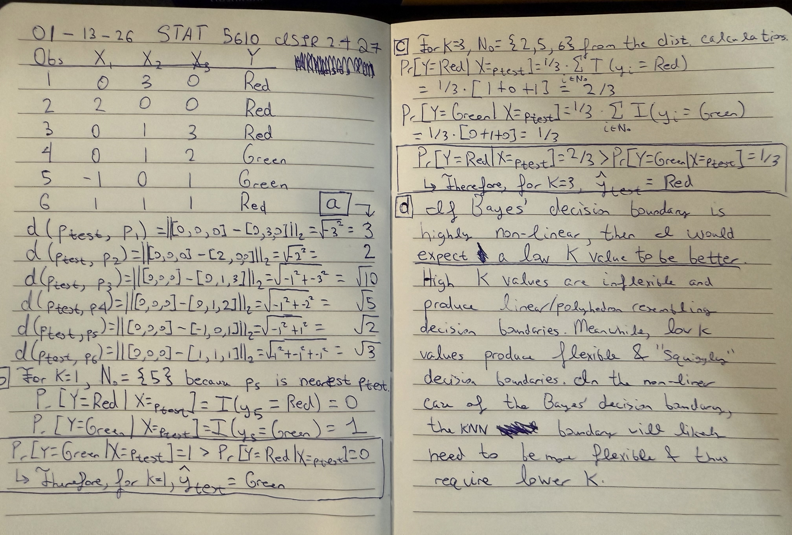

```{r setup, include=FALSE}
knitr::opts_chunk$set(echo = TRUE)
library(tidyverse)
library(ISLR2)
```

## Overall Description of Homework 0

**Due: 11:59PM Wednesday, January 14 on Canvas**

1.  You will practice using R.
2.  Using Quarto (very similar to R Markdown), you will complete one reading exercise, one reflection exercise, one "mathematical" exercise, one "applied" exercise from ISLR2, and one "ethical reflection".
3.  Knit your document to pdf and submit on Canvas.

### Instructions for Homework 0

1.  Read the Table of Contents in ISLR2. Compare to the syllabus modules of what we plan to cover. Write a short paragraph about what excites you most about the topics we plan to cover and about which topic(s) you are least enthusiastic about learning.
2.  Work through the practice exercises in section 2.3 of ISLR2. You do not need to turn in these exercises. If you know how to do things in R in ways that are better than what the book is suggestion, that's great! The "tidyverse" suite of packages often enable you to do things in easier and more intuitive ways than base R.
3.  Work through exercises 1-6 in section 2.4 of ISLR2. Do not turn your answers in. Some of these exercises may be on the individual and team test in class on Friday, January 16.
4.  Create an individual HW0 document using Quarto from RStudio. Quarto is almost just like R Markdown, except it works with Python and some other programming languages in addition to R. Knit your document to PDF (HTML usually looks much better, but Canvas doesn't like them). <https://quarto.org/docs/visual-editor> is a good starting point for learning how to use Quarto.
5.  Write a one-paragraph reflection statement. Some things to reflect on: How comfortable are you in R? How familiar are you with the tidyverse packages? How easy were the exercises in section 2.3 of ISLR2? How excited are you about this "Statistical Learning" course? What concerns do you have about the course? Would you rather use R or Python for your homework exercises? Anything else you'd like the professor and TA to know?
6.  On your individual document, complete Exercise 7 (k-nearest neighbors by hand on p 54) from ISLR2 2.4. Write your answers in the document.
7.  Complete applied exercise 8, 9, or 10 (you choose which one, you can do all three if you want). Show the code you use to generate your answers and your plots. The code should be in code chunks within your document.
8.  Briefly reflect on the ethical implications of this applied work. Are there any potential harms from this work? Who might benefit from this work? Your reflection should be about one paragraph (at least two sentences).

The intended audience for your document is the professor and the TA.

#### Some intended outcomes from this assignment

-   You will learn how to create documents in RStudio using Quarto
-   You will familiarize yourself with the topics to be learned in ISLR2
-   You will reflect about your comfort level with R
-   You will check and improve your understanding of the material in ISLR chapters 1 and 2
-   You will gain some intuition about the K-nearest neighbors method
-   You will get practice manipulating a dataset and extracting useful information from it
-   You will practice reflecting on the ethics of statistical learning


## Answers

### Q1

I am most excited for the model selection, beyond linearity, and tree topics (chapters 5-8 of ISLR), and I am least excited to cover support vector machines (SVM) and deep learning topics (chapters 9-10 of ISLR). I am excited for these topics because I have some knowledge gaps that I want to address. For model selection, I want to understand when three splits (train, evaluation, and test) are required versus only two splits (train and test). Meanwhile, the beyond linearity methods (e.g., splines) and tree-based models are methods where I am lacking a mathematical understanding of their implementation. Conversely, I am least excited for the SVM and deep learning topics because I have covered them multiple times in previous courses. In convex optimization final exam, I had to derive the dual formulation of the SVM, which was challenging. Lastly, I dislike how the amount of computing resources and time required for deep learning methods.

### Q2

No answer required.

### Q3

No answer required.

### Q4

This is a Quarto document knitted to PDF.

```
# example bash code for rendering
quarto render hw0.qmd
```

### Q5

I used to be comfortable in R, but it will take some time to get familiar again. Previously, I was a developer for an evolutionary biology web-app using R shiny (https://jravilab.cuanschutz.edu/molevolvr/app_direct/molevolvr_app/), and at the same research position I wrote R packages related to antimicrobial resistance machine learning and dataset curation. However, I stopped using R in Summer of 2024; I prefer to use Python and Bash instead. Regarding tidyverse packages, I am confident I can recall how to use them. I found the section 2.3 exercises of ISLR straightforward. I am very excited about this statistical learning course because statistics is my favorite subject in science, despite being a computer science major. Since I enjoy studying statistics, I have no major concerns about the course. Finally, I would prefer to use Python for the homework exercises, but it seems like the instructor and curriculum are tailored towards R language. 

### Q6



### Q7 Applied exercise 8

#### a) load data

I used the builtin download.file and read.csv functions to download and load the College dataset from the ISLR website.

```{r}
url <- "https://www.statlearning.com/s/College.csv"
outfile <- "/data/jake/stat-5610-statistical_learning/college.csv"
download.file(url, destfile = outfile)
college <- read.csv(outfile)
```

#### b) setting rownames

I set the first data column to rownames and removed the redundant first column.

```{r}
# set rownames to the college names
rownames(college) <- college[, 1]
# commented out for knit
#View(college)
```

```{r}
# remove redundant first column
college <- college[, -1]
```

#### c) summary

##### c.i)

I viewed basic statistics such as median and quartiles of each column using the summary function.

```{r}
# basic stats of columns
summary(college)
```

I notice most variables are quantitative, not qualitative.

##### c.ii)

I plotted pairwise scatter plots of the first 10 columns to visualize relationships between variables. This required encoding the "Private" column from "Yes"/"No" to 1/0.

```{r}
# map private yes/no to 1/0
college$Private <- ifelse(college$Private == "Yes", 1, 0)
# scatter plot all 10 choose 2 pairs of first 10 columns
pairs(college[, 1:10])
```

Visually I see qualitative correlation between outstate tuition cost and room and board cost

##### c.iii) Comparing outstate tuition for private vs. non-private colleges

I compared the distributions of Outstate tuition for private and non-private colleges using boxplots.

```{r}
plot(factor(college$Private, levels = c(0, 1),
            labels = c("No", "Yes")),
     college$Outstate,
     xlab = "Private",
     ylab = "Outstate Tuition",
     main = "Outstate Tuition by Private/Public College"
)
```

Private colleges generally have higher outstate tuition than non-private colleges.

#### c.iv) Defining "Elite" colleges and comparing Outstate tuition

Define schools with greather than 50% of students from the top 10% of their high school class as "Elite".
```{r}
Elite <- rep("No", nrow(college))
# shouldn't the righthand side be 1/2 enroll, not a fixed 50?
Elite[college$Top10perc > 50] <- "Yes"
Elite <- as.factor(Elite)
college <- data.frame(college, Elite)
```

Use summary to count number of elite colleges.
```{r}
summary(college$Elite)
```

There are 78 elite colleges.

Compare Outstate tuition for elite vs. non-elite colleges using boxplots.
```{r}
plot(college$Elite,
        college$Outstate,
        xlab = "Elite College",
        ylab = "Outstate Tuition",
        main = "Outstate Tuition by Elite/Non-Elite College"
)
```

As expected, elite colleges generally have higher outstate tuition than non-elite colleges.

#### c.v) Histograms of 4 quantitative variables

I created histograms for the variables PhD, Room.Board, Grad.Rate, and Books.

```{r}
par(mfrow = c(2, 2))
hist(college$PhD,
     main = "Histogram of PhD",
     xlab = "Percent of Faculty with PhD")
hist(college$Room.Board,
     main = "Histogram of Room and Board",
        xlab = "Room and Board Cost")
hist(college$Grad.Rate,
        main = "Histogram of Graduation Rate",
        xlab = "Graduation Rate (%)")
hist(college$Books,
        main = "Histogram of Books Cost",
        xlab = "Books Cost")
```

- The percent of faculty with PhD is much higher than 50% across most colleges.
- Room and board ranges from about $2,000 to $8,000, with a mean roughly at $5,000.
- Graduation rates are centered around 70%. It seems like a college exists with graduation rate above 100%, which is strange.
- Book costs are centered around $500, but there is a right tail to the distribution indicating a few college have very high book costs.

#### c.vi) Exploring

Which universities have highest ratio of application to enrollment?

```{r}
college |>
  mutate(App_to_Enroll = Apps / Enroll) |>
    arrange(desc(App_to_Enroll)) |>
    select(App_to_Enroll) |>
    head(10)
```

What about highest ratio of application to acceptance?

```{r}
college |>
    mutate(App_to_Accept = Apps / Accept) |>
    arrange(desc(App_to_Accept)) |>
    select(App_to_Accept) |>
    head(10)
```

Are high ratio application to enrollment universities all elite?

```{r}
college |>
    mutate(App_to_Enroll = Apps / Enroll) |>
    arrange(desc(App_to_Enroll)) |>
    select(App_to_Enroll, Elite) |>
    head(10)
```

Are high ratio application to acceptance universities all elite?

```{r}
college |>
    mutate(App_to_Accept = Apps / Accept) |>
    arrange(desc(App_to_Accept)) |>
    select(App_to_Accept, Elite) |>
    head(10)
```


As expected, the most selective universities (highest application to acceptance ratio) are all elite. Meanwhile, the universities with highest application to enrollment ratio are not necessarily elite. There is some overlap between the two lists, such as Princeton University.

### Q8 Ethical reflection

This work was purely for practice in exploring data, and there are no ethical implications. I do not expect an harms to come from completing this assignment. Completing the assignment benefitted my education with respect to data exploration in R and familiarizing myself with the first two chapters of the ISLR textbook.
    